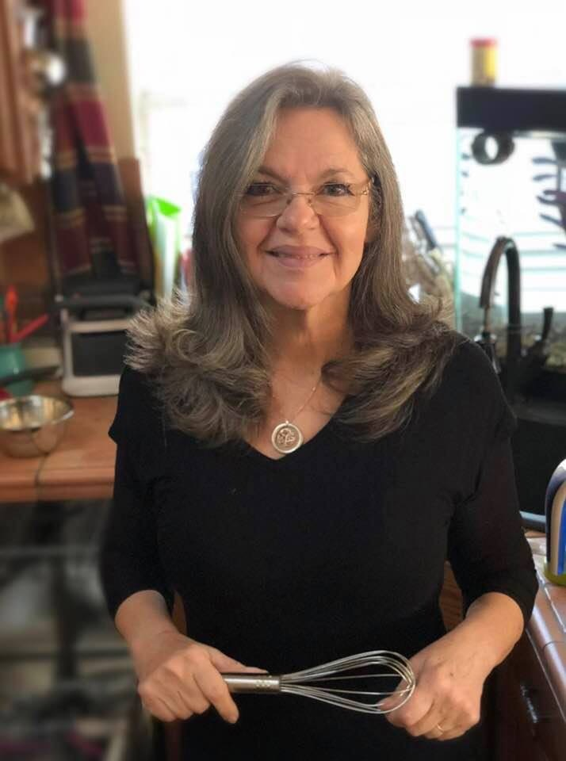

## [Home](./index.md) | [Meet Sharon](./MeetSharon.md) | [My Vision](./MyVision.md) | [Events](./Events.md) | [County Commissioner](./CountyCommissioner.md) | [Shop](./Shop.md) | [Volunteer](./Volunteer.md) | [Donate](./Donate.md) 

# Meet Sharon Cummings

Born in Cameron, TX, Sharon Jean Cummings grew up in Montevideo, Uruguay, from age 2 to age 12, with teenage years spent in El Paso, TX, graduating from Irvin High School, then earned a Bachelor of Science from Baylor University in Waco, TX.

After marrying Larry Cummings (who eventually retired from the Navy as the Command Master Chief of the USS Carl Vinson - at the time the largest aircraft carrier in the world), she enjoyed all aspects of life on Navy Bases.  

She served as Ombudsman for VP-6 and then became the President of the Ombudsman of Hawaii.

Sharon served as a Contracting Officer for The Pacific Division of the Navy in Pearl Harbor, Hawaii before moving to the Port Hueneme Division of the Naval Surface Warfare Center in California to serve as first a Contracting Officer, and then a Program Analyst.

Sharon has lived in Round Rock, TX for the last 20 years.

Her focus is on the quality of life we are building for our grandkids.  

* This includes the air we all breathe, the water we all drink, the quality and accessibility of our Public Schools, the sustainability of our energy sources, the attitude and training of our Sheriff’s Personnel, the availability of mass transportation, the respect we show every human being in Williamson County, regardless of how similar or different they seem from ourselves.  

* It is to the advantage of all of us, regardless of our wealth, to have affordable housing available throughout our county for those who work in this area.  

* When we make health services realistically available to everyone in this county, we are all better off health-wise, as preventable diseases are cared for before they are spread by those who cannot afford the help that is currently structured through for-profit companies. 

* Tomorrow is coming.  We are running out of room to pollute the Earth.  We have to move dramatically into Solar and Wind Power, because Oil and Gas and Nuclear are destroying this planet that we hold in trust for future generations.

